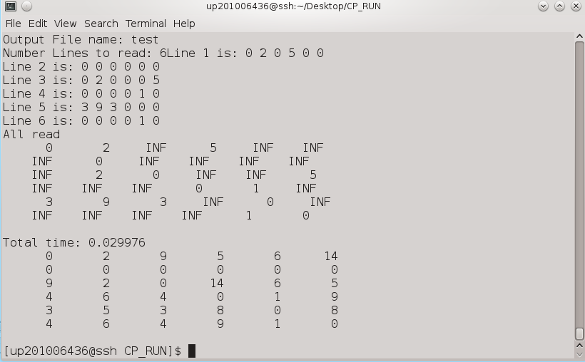

## Synopsis

MPI Matrix Multiplication using FOX algorithm.
Work developed in the CP from FCUP.

 
## Features 

User defines the input file and output file.

## Videos/Images

computation with matrix 6X6.  
  

## Contributors

Main Developer :HSO  
Email: hugo(dot)soares(at)fe(dot)up(dot)pt
